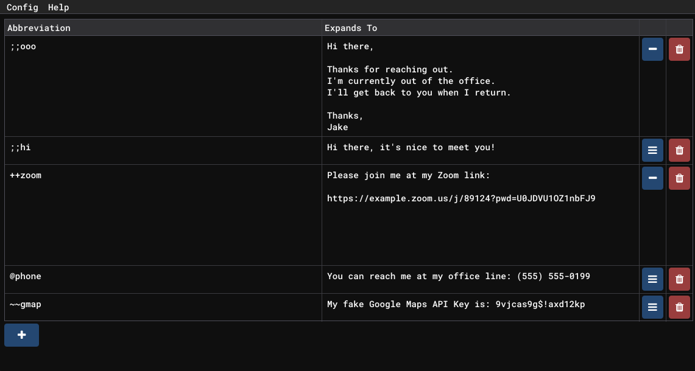

A text expansion solution for Windows that allows the user to auto-expand abbreviations into full strings.

## Usage

abbrv (pronounced /əˌbrēvē) provides a simple means of creating text abbreviations that expand into
single, or multi, line results. For example, here's a series of potential abbreviations you might
have defined:

While abbrv is running, typing the abbreviation into _any_ program will replace the typed
abbreviation with its associated expansion. You can see an example of this running in Notepad below,
but the effect is the same in Outlook, Slack, Discord, etc.

https://user-images.githubusercontent.com/12981369/185303270-7d0616ec-620b-4568-b092-a47a1e6f9dcc.mp4

## FAQ

### 1. How do I prevent abbreviations from activating when I don't want them to?

I suggest starting all of your abbreviations with a unique prefix that you are unlikely to type by mistake.
For example, I use ';;' as a prefix to all of my abbreviations like so: ';;phone' or ';;apikey'.

### 2. Are there any universally useful expansions?

These vary widely, but common language shorthands which you can't use in a professional setting are
good candidates:

- a11y -> accessibility
- i18n -> internationalization
- asap -> as soon as possible

And so on. I _highly_ suggest using a prefix on all of these!

### 3. My abbreviation will not expand! Why not?

Make sure that you don't have an illusive space hiding before, or after, the abbreviation. It's most likely
that you've typed 'my_abbreviation ' when you really meant to type 'my_abbreviation'.

### 4. Can I save my settings across multiple machines?

Yes, simply copy the 'config.abbrv' file that found alongside abbrv.exe to the same folder as the
executable on another machine and all of your abbreviations will be there. You can quickly find the
'config.abbrv' file by clicking Help -> Open in Explorer."

### 5. Does this work while abbrv is minimized?

Yes. As long as you minimize the window (it goes to the system tray area, not taskbar!) it will
continue to work. Closing the window will disable the expansion functionality.

### 6. Can I use this for expanding code snippets in X editor?

The likely answer is yes, _but_ you should probably find a better code/snippet expander for programming.
Most editors these days will have some sort of context-aware expansion features that are far more beneficial
than abbrv is in that regard. The purpose of abbrv is to allow simple text expansion across _any_ application
or interface.

---

This project was created as part of the Wheel Reinvention Jam 2022: a one-week jam to change the status
quo.

